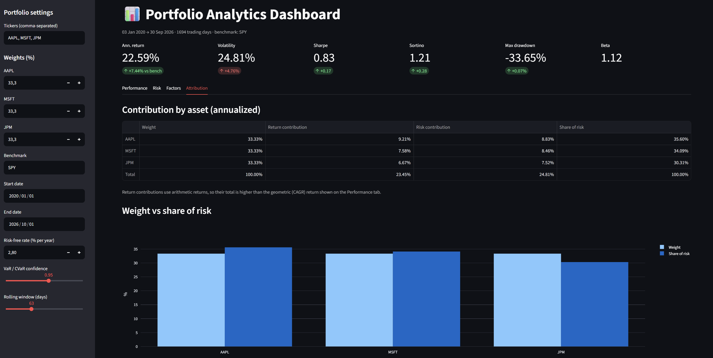
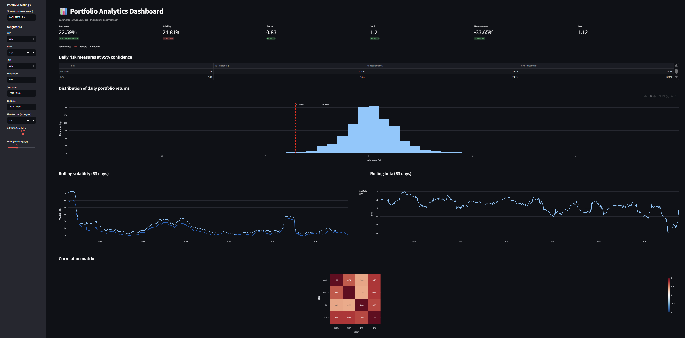
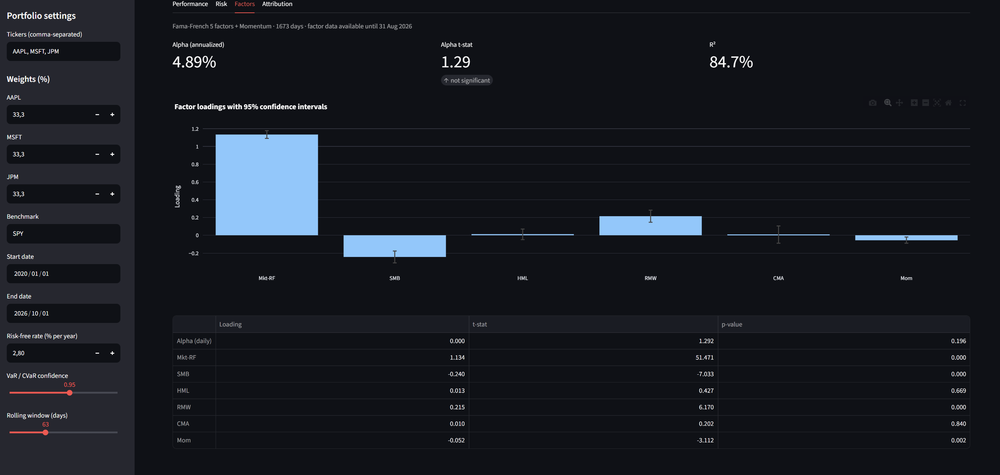
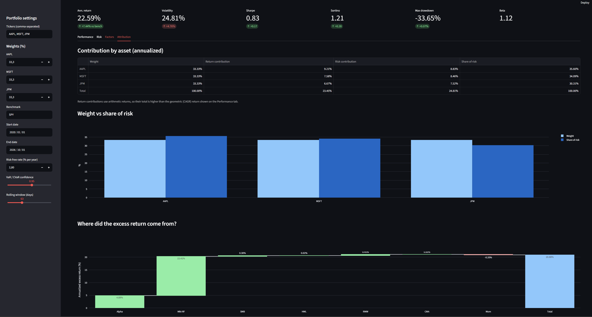

# 📊 Automated Portfolio Analytics Dashboard

An interactive dashboard that analyzes any stock portfolio in seconds: performance, risk, factor exposures, and attribution. Enter tickers and weights, and the app downloads market data, computes institutional-grade analytics, and benchmarks the portfolio against an index.

**🔗 Live demo: [YOUR-APP-LINK](https://portfolio-analysis-investments.streamlit.app/)**

Built with Python, Streamlit, Plotly, pandas, statsmodels, and yfinance.



---

## Features

The dashboard is organized into a KPI header and four tabs.

**KPI header:** annualized return, volatility, Sharpe ratio, Sortino ratio, maximum drawdown, and beta, each compared against the benchmark.

**Performance:** cumulative return and drawdown ("underwater") charts versus the benchmark, plus a summary statistics table.

**Risk:** historical and parametric Value at Risk, historical CVaR (Expected Shortfall) at an adjustable confidence level, a return distribution histogram with VaR/CVaR thresholds, rolling volatility and rolling beta over a selectable window, and an asset correlation heatmap.

**Factors:** regression of portfolio excess returns on the Fama-French 5 factors plus Momentum, with factor loadings, 95% confidence intervals, annualized alpha, its t-statistic, and R².

**Attribution:** return and risk contribution by asset (Euler decomposition of volatility), a weight versus share-of-risk comparison, and a waterfall chart decomposing excess return into alpha and factor contributions.

All inputs are configurable from the sidebar: tickers, weights, benchmark, date range, risk-free rate, VaR confidence level, and rolling window.

## Screenshots

| Risk | Factors | Attribution |
|------|---------|-------------|
|  |  |  |

---

## Methodology

**Returns.** Daily simple returns are computed from dividend- and split-adjusted closing prices. Simple returns are used (rather than log returns) because they aggregate exactly across assets: the portfolio return is the weighted sum of asset returns.

**Annualized return.** Geometric (CAGR): $\left(\prod (1 + r_t)\right)^{252/N} - 1$. This is the return an investor actually earned, and avoids the upward bias of the arithmetic mean (volatility drag).

**Volatility.** Daily standard deviation scaled by $\sqrt{252}$ (square-root-of-time rule, which assumes independent daily returns).

**Sharpe ratio.** $\dfrac{\bar{r} - r_f}{\sigma} \times \sqrt{252}$, using the arithmetic mean of daily excess returns, following the industry convention.

**Sortino ratio.** Same numerator as Sharpe, divided by downside deviation $\sqrt{\text{mean}(\min(r - r_f, 0)^2)}$, so only downside volatility is penalized. All days are kept in the calculation, with positive days contributing zero.

**Maximum drawdown.** Largest peak-to-trough decline of the cumulative wealth curve.

**Beta.** $\beta = \dfrac{\text{Cov}(r_p, r_m)}{\text{Var}(r_m)}$ against the chosen benchmark.

**VaR and CVaR.** Historical VaR is the empirical quantile of daily returns. Parametric VaR assumes normality: $-(\mu + z_\alpha \sigma)$. Historical CVaR is the average loss on days worse than the VaR. Losses are reported as positive numbers.

**Factor model.** OLS regression of daily excess returns on the Fama-French 5 factors (Mkt-RF, SMB, HML, RMW, CMA) and Momentum, downloaded directly from Kenneth French's Data Library, with heteroskedasticity-robust (HC3) standard errors:

$$r_p - r_f = \alpha + \beta_1 \text{MKT} + \beta_2 \text{SMB} + \beta_3 \text{HML} + \beta_4 \text{RMW} + \beta_5 \text{CMA} + \beta_6 \text{MOM} + \varepsilon$$

**Return attribution.** Contribution of asset $i$ = $w_i \times \bar{r}_i \times 252$. Arithmetic means are used because they are additive across assets, so contributions sum exactly to the portfolio's arithmetic return.

**Risk attribution.** Euler decomposition: $RC_i = w_i \dfrac{(\Sigma w)_i}{\sigma_p}$. Since volatility is homogeneous of degree 1 in the weights, contributions sum exactly to portfolio volatility.

**Factor attribution.** Contribution of factor $k$ = $\beta_k \times \bar{f}_k \times 252$. Because OLS residuals average to zero when an intercept is included, alpha plus factor contributions sum exactly to the mean excess return.

Every decomposition is validated in the code with sanity checks (contributions sum to totals; the benchmark's beta against itself equals 1).

---

## Example findings

Sample portfolio: 40% AAPL, 30% MSFT, 30% JPM, benchmarked against SPY, January 2020 to December 2025.

| | Portfolio | SPY |
|---|---|---|
| Annualized return | 23.61% | 15.02% |
| Volatility | 25.72% | 20.75% |
| Sharpe ratio | 0.86 | 0.66 |
| Max drawdown | −33.37% | −33.72% |
| Beta | 1.15 | 1.00 |

**Diversification reduces volatility but not crash risk.** Portfolio volatility (25.7%) is well below the weighted average of the stocks' volatilities (31.0%), yet the maximum drawdown is almost identical to SPY's. During the March 2020 crash, correlations converged towards 1 and stock-only diversification disappeared when it was needed most.

**Fat tails.** The ratio of CVaR to VaR at 95% ranges from 1.45 to 1.73, against roughly 1.25 under normality, and the factor regression residuals show a kurtosis of 5.5. The normal distribution overstates VaR at moderate confidence levels and understates it deep in the tail.

**Weights are not risk.** AAPL represents 40% of capital but 44% of risk, while JPM (30% of capital) contributes only 26% of risk thanks to its lower correlation with the two technology stocks.

**Factor profile.** The portfolio shows a significant large-cap tilt (SMB = −0.24, t = −9.9) and quality tilt (RMW = 0.21, t = 7.3). Its value/growth exposure is neutral only because JPM's value tilt offsets the growth tilt of AAPL and MSFT. The factors explain 87% of daily variance, and about 72% of the excess return came from market exposure alone.

**Alpha is not significant.** The annualized alpha of 4.8% has a t-statistic of 1.25, so it cannot be distinguished from noise. It is also inflated by look-ahead bias, since the stocks were selected with knowledge of their past performance.

---

## Project structure

```
├── app.py               # Streamlit dashboard (interface only)
├── requirements.txt     # Pinned dependencies
├── screenshots/                # Screenshots for this README
└── src/
    ├── data.py          # Price download, returns, portfolio returns
    ├── metrics.py       # Return, volatility, Sharpe, Sortino, drawdown
    ├── risk.py          # Beta, VaR, CVaR
    ├── factors.py       # Fama-French data loader and factor regression
    └── attribution.py   # Return, risk, and factor attribution
```

Calculations are separated from the interface: each module in `src/` is independent, testable, and can be run on its own (`python -m src.metrics`) to print a sample analysis.

## Run it locally

```bash
git clone https://github.com/YOUR-USERNAME/YOUR-REPO-NAME.git
cd YOUR-REPO-NAME
python -m venv venv
venv\Scripts\activate          # Windows
# source venv/bin/activate     # macOS / Linux
pip install -r requirements.txt
streamlit run app.py
```

Requires Python 3.10 or higher.

---

## Assumptions and limitations

The portfolio is rebalanced daily to constant weights, and transaction costs and taxes are ignored. The risk-free rate is a constant chosen by the user. VaR and CVaR are one-day measures, and parametric VaR assumes normally distributed returns, which the data contradicts in the tails. Fama-French factor data is published with a lag of a few months, so the factor regression may cover a shorter period than the rest of the dashboard. Return attribution uses arithmetic returns, so its total differs from the geometric return shown on the Performance tab. Market data comes from Yahoo Finance through yfinance, which is unofficial and occasionally rate-limited.

## Possible extensions

Monte Carlo and Cornish-Fisher VaR, VaR backtesting (Kupiec test), mean-variance and risk-parity optimization, Brinson sector attribution, user-defined rebalancing frequencies with transaction costs, and a unit test suite with pytest.

---

## Author

**Mazen Ismail**
[LinkedIn](YOUR-LINKEDIN-URL) · [GitHub](https://github.com/YOUR-USERNAME)